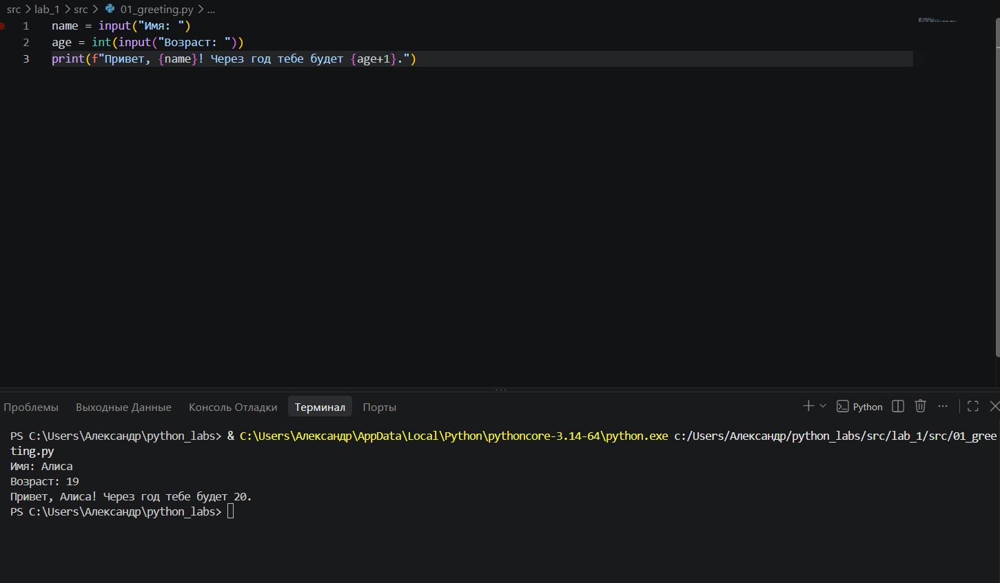
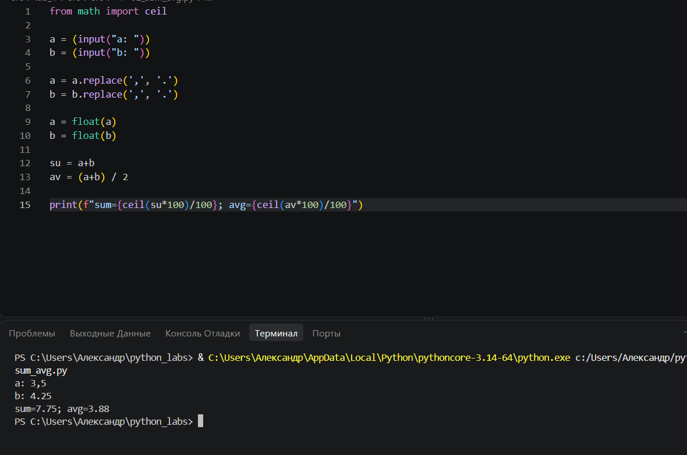
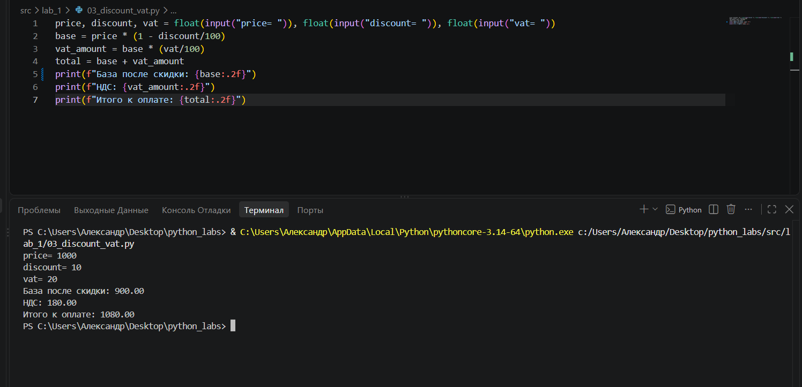
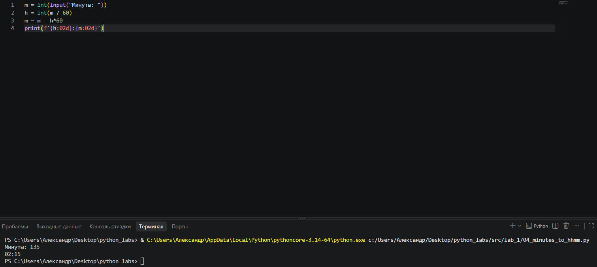
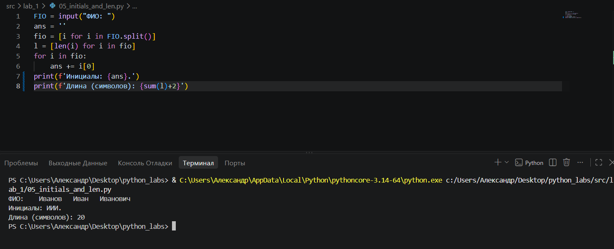
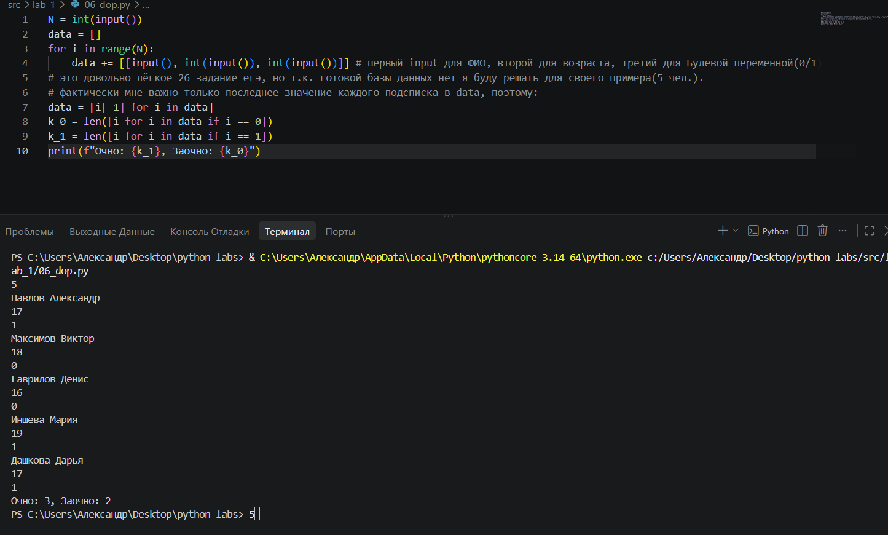
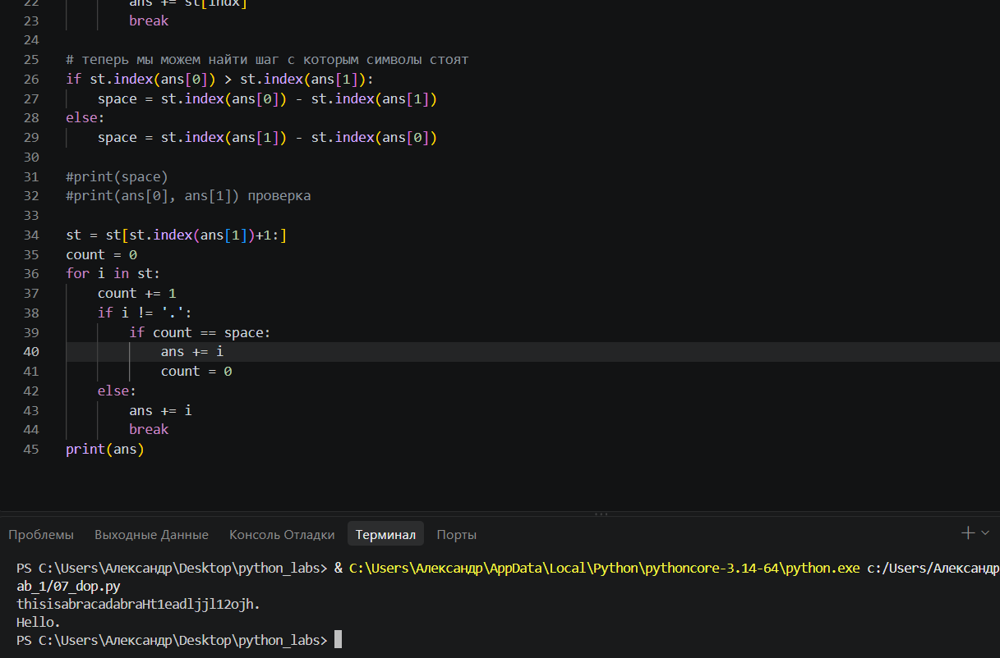

Репозиторий с решениями лабораторных работ на Python.
В разделе src собраны скрипты, в разделе images - скриншоты работы программ.
В данный момент в репозитории есть всё, касающиеся ЛБ-1 по теме "Ввод/вывод и форматирование".

Лабораторная работа № 1

Задача № 1

Задача № 2

Задача № 3

Задача № 4

Задача № 5

Задача № 6

Задача № 7

