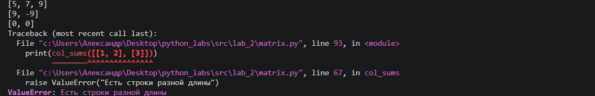
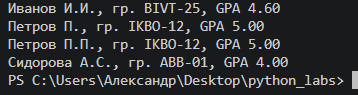

Лабораторная работа № 2

Задача № 1
'''
def min_max(nums: list[float | int]) -> tuple[float | int, float | int]:
    """
    Параметры:
        nums: список чисел.

    Возвращает:
        Кортеж из двух элементов: (минимум, максимум).

    Вызывает:
        ValueError: если список пуст.
    """
    if not nums:
        raise ValueError("Список пуст")
    return min(nums), max(nums)

def unique_sorted(nums: list[float | int]) -> list[float | int]:
    """
    Параметры:
        nums: список чисел.

    Возвращает:
        Отсортированный список уникальных значений по возрастанию.
    """
    return sorted(set(nums))

def flatten(mat: list[list | tuple]) -> list:
    """
    Параметры:
        mat: список списков/кортежей.

    Возвращает:
        Список, «расплющенный» по строкам (row-major).

    Вызывает:
        TypeError: если встретился элемент, не являющийся списком или кортежем.
    """
    row_major = []
    if not all(isinstance(i, (list, tuple)) for i in mat):
        raise TypeError("Встретился элемент, который не является списком/кортежем")
    else:
        for i in mat:
            for j in i:
                row_major.append(j)
        return row_major
    
if __name__ == "__main__":
    # TEST min_max
    print(min_max([3, -1, 5, 5, 0]))
    print(min_max([42]))
    print(min_max([-5, -2, -9]))
    print(min_max([]))
    print(min_max([1.5, 2, 2.0, -3.1]))
    # TEST unique_sorted
    print(unique_sorted([3, 1, 2, 1, 3]))
    print(unique_sorted([]))
    print(unique_sorted([-1, -1, 0, 2, 2]))
    print(unique_sorted([1.0, 1, 2.5, 2.5, 0]))
    # TEST flatten
    print(flatten([[1, 2], [3, 4]]))
    print(flatten([[1, 2], (3, 4, 5)]))
    print(flatten([[1], [], [2, 3]]))
    print(flatten([[1, 2], "ab"]))
'''

Задача № 2
'''
def transpose(mat: list[list[float | int]]) -> list[list]:
    """
    Параметры:
        mat: матрица.
    
    Возвращает:
        Транспонированная матрица.
    
    Вызывает:
        ValueError: если строки разной длины (не прямоугольная матрица).
    """
    if not mat:
        return []
    elif not all(len(i) == len(mat[0]) for i in mat):
        raise ValueError("Есть строки разной длины")
    else:
        rows_len = len(mat)
        columns_len = len(mat[0])
        '''
        чтобы проверить что это работает именно так я рассмотрел 2 матрицы:
        1 2 3
        4 5 6

        1 2 3 4
        5 6 7 8

        можно заметить, что длина строки == количеству столбцов при условии, что все строки одной длины.
        '''
        transposed_mat = [[0] * rows_len for i in range(columns_len)]
        for rows in range(rows_len):
            for columns in range(columns_len):
                transposed_mat[columns][rows] = mat[rows][columns]
        return transposed_mat

def row_sums(mat: list[list[float | int]]) -> list[float]:
    """
    Параметры:
        mat: матрица.
        
    Возвращает:
        Сумма каждой строки.
        
    Вызывает:
        ValueError: если строки разной длины (не прямоугольная матрица).
    """
    if not mat:
        return "Пустая матрица"
    elif not all(len(i) == len(mat[0]) for i in mat):
        raise ValueError("Есть строки разной длины")
    else:
        return [sum(i) for i in mat]

def col_sums(mat: list[list[float | int]]) -> list[float]:
    """
    Параметры:
        mat: матрица.
        
    Возвращает:
        Сумма каждого столбца.
        
    Вызывает:
        ValueError: если строки разной длины (не прямоугольная матрица).    
    """
    if not mat:
            return "Пустая матрица"
    elif not all(len(i) == len(mat[0]) for i in mat):
        raise ValueError("Есть строки разной длины")
    else:
        total_sum = [0 for col in mat[0]]
        for row in mat:
            for col in row:
                indx = row.index(col)
                total_sum[indx] += col
        return total_sum
                
if __name__ == "__main__":
    # TEST transpose
    print(transpose([[1, 2, 3]]))
    print(transpose([[1], [2], [3]]))
    print(transpose([[1, 2], [3, 4]]))
    print(transpose([]))
    print(transpose([[1, 2], [3]]))
    # TEST row_sums
    print(row_sums([[1, 2, 3], [4, 5, 6]]))
    print(row_sums([[-1, 1], [10, -10]]))
    print(row_sums([[0, 0], [0, 0]]))
    print(row_sums([[1, 2], [3]]))
    # TEST col_sums
    print(col_sums([[1, 2, 3], [4, 5, 6]]))
    print(col_sums([[-1, 1], [10, -10]]))
    print(col_sums([[0, 0], [0, 0]]))
    print(col_sums([[1, 2], [3]]))
'''

Задача № 3
'''
def format_record(rec: tuple[str, str, float]) -> str:
    """
    Параметры:
        rec: кортеж вида: (fio: str, group: str, gpa: float).
            
    Возвращает:
        Строка вида: Иванов И.И., гр. BIVT-25, GPA 4.60.
            
    Вызывает:
        ValueError: если пустое ФИО или пустая группа.
        TypeError: если неверный тип GPA.
    """
    if not rec[0]:
        raise ValueError("пустое ФИО")
    if not rec[1]:
        raise ValueError("пустая группа")
    if not isinstance(rec[2], float):
        raise TypeError("неверный тип GPA")
    initials = rec[0]
    initials = str.title(initials)
    initials = [i for i in initials.split()]
    last_name = initials[0]
    if len(initials) == 2:
        name = initials[1][0] + '.'
        patronymic = ''
    elif len(initials) == 3:
        name = initials[1][0] + '.'
        patronymic = initials[2][0] + '.'
    group = rec[1]
    gpa = rec[2]
    return f'{last_name} {name}{patronymic}, гр. {group}, GPA {gpa:.2f}'
if __name__ == "__main__":
    print(format_record(("Иванов Иван Иванович", "BIVT-25", 4.6)))
    print(format_record(("Петров Пётр", "IKBO-12", 5.0)))
    print(format_record(("Петров Пётр Петрович", "IKBO-12", 5.0)))
    print(format_record(("  сидорова  анна   сергеевна ", "ABB-01", 3.999)))
'''
