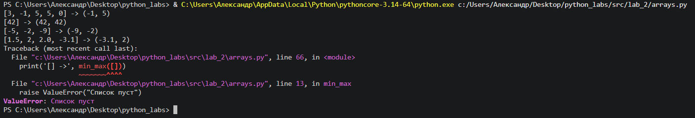
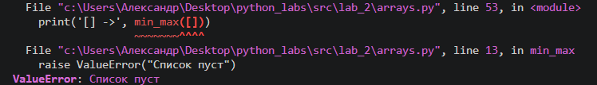
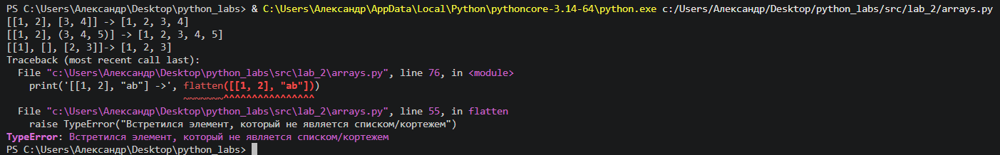
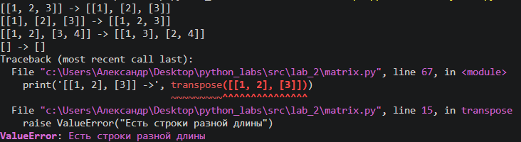
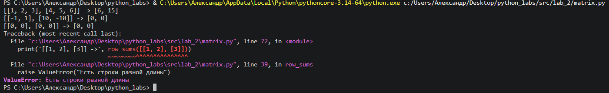
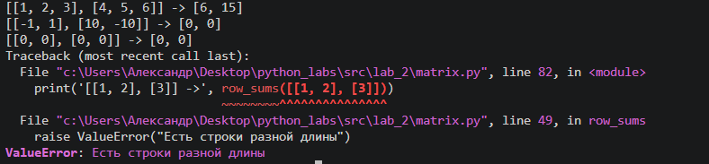
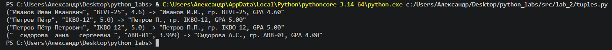

Лабораторная работа № 2

Задача № 1 
```python
def min_max(nums: list[float | int]) -> tuple[float | int, float | int]:
    """
    Параметры:
        nums: список чисел.

    Возвращает:
        Кортеж из двух элементов: (минимум, максимум).

    Вызывает:
        ValueError: если список пуст.
    """
    if not nums:
        raise ValueError("Список пуст")
    minimum = maximum = nums[0]
    for x in nums[1:]:
        if x < minimum:
            minimum = x
        if x > maximum:
            maximum = x
    return minimum, maximum
```


```python
def unique_sorted(nums: list[float | int]) -> list[float | int]:
    """
    Параметры:
        nums: список чисел.

    Возвращает:
        Отсортированный список уникальных значений по возрастанию.
    """
    unique_nums = list(set(nums))
    for i in range(1, len(unique_nums)):
        key = unique_nums[i] # элемент, который хотим вставить
        j = i - 1 # индекс последнего отсортированого элемента
        while j >= 0 and unique_nums[j] > key: # если элемент > key, сдвигаем вправо
            unique_nums[j + 1] = unique_nums[j]
            j -= 1
        unique_nums[j + 1] = key # вставляем нужный элемент в освободившееся место
    return unique_nums
```


```python
def flatten(mat: list[list | tuple]) -> list:
    """
    Параметры:
        mat: список списков/кортежей.

    Возвращает:
        Список, «расплющенный» по строкам (row-major).

    Вызывает:
        TypeError: если встретился элемент, не являющийся списком или кортежем.
    """
    row_major = []
    for row in mat:
        if not isinstance(row, (list, tuple)):
            raise TypeError("Встретился элемент, который не является списком/кортежем")
        for item in row:
            row_major.append(item)
    return row_major
```


Задача № 2
```python
def transpose(mat: list[list[float | int]]) -> list[list]:
    """
    Параметры:
        mat: матрица.
    
    Возвращает:
        Транспонированная матрица.
    
    Вызывает:
        ValueError: если строки разной длины (не прямоугольная матрица).
    """
    if not mat:
        return []
    elif not all(len(i) == len(mat[0]) for i in mat):
        raise ValueError("Есть строки разной длины")
    else:
        rows_len = len(mat)
        columns_len = len(mat[0])
        transposed_mat = [[0] * rows_len for i in range(columns_len)]
        for rows in range(rows_len):
            for columns in range(columns_len):
                transposed_mat[columns][rows] = mat[rows][columns]
        return transposed_mat
```


```python
def row_sums(mat: list[list[float | int]]) -> list[float]:
    """
    Параметры:
        mat: матрица.
        
    Возвращает:
        Сумма каждой строки.
        
    Вызывает:
        ValueError: если строки разной длины (не прямоугольная матрица).
    """
    if not mat:
        return []
    elif not all(len(i) == len(mat[0]) for i in mat):
        raise ValueError("Есть строки разной длины")
    else:
        return [sum(i) for i in mat]
```


```python
def col_sums(mat: list[list[float | int]]) -> list[float]:
    """
    Параметры:
        mat: матрица.
        
    Возвращает:
        Сумма каждого столбца.
        
    Вызывает:
        ValueError: если строки разной длины (не прямоугольная матрица).    
    """
    if not mat:
            return "Пустая матрица"
    elif not all(len(i) == len(mat[0]) for i in mat):
        raise ValueError("Есть строки разной длины")
    else:
        return row_sums(transpose(mat))
```


Задание № 3
```python
def format_record(rec: tuple[str, str, float]) -> str:
    """
    Параметры:
        rec: кортеж вида: (fio: str, group: str, gpa: float).
            
    Возвращает:
        Строка вида: Иванов И.И., гр. BIVT-25, GPA 4.60.
            
    Вызывает:
        ValueError: если пустое ФИО или пустая группа.
        TypeError: если неверный тип GPA.
    """
    if not rec[0].strip():
        raise ValueError("пустое ФИО")
    if not rec[1].strip():
        raise ValueError("пустая группа")
    if not isinstance(rec[2], float):
        raise TypeError("неверный тип GPA")
    initials = rec[0]
    initials = str.title(initials)
    initials = [i for i in initials.split()]
    last_name = initials[0]
    if len(initials) == 2:
        name = initials[1][0] + '.'
        patronymic = ''
    elif len(initials) == 3:
        name = initials[1][0] + '.'
        patronymic = initials[2][0] + '.'
    group = rec[1]
    gpa = rec[2]
    return f'"{last_name} {name}{patronymic}, гр. {group}, GPA {gpa:.2f}"'
```

