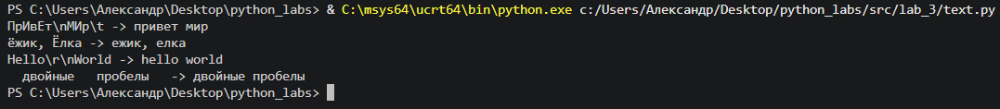
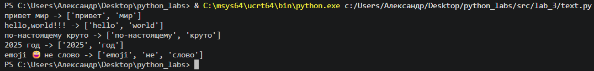
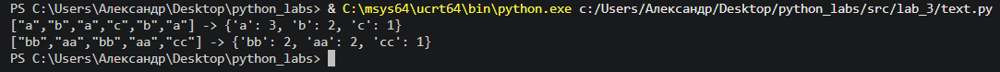
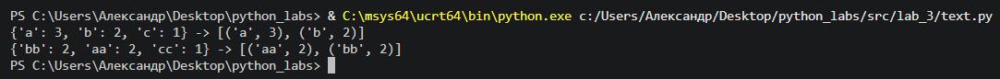
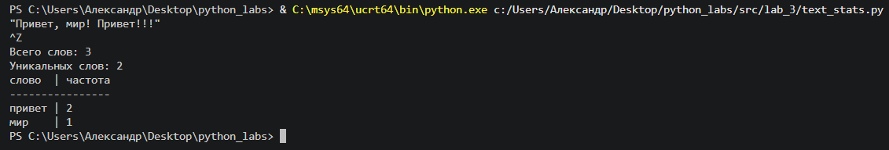

Лаботаторная работа № 3

Задание A
```python
def normalize(text: str, *, casefold: bool = True, yo2e: bool = True) -> str:
    """
    Нормализовать текст

    Args:
        text: строка
        casefold: приводить ли буквы к нижнему регистру
        yo2e: заменять ли "ё" на е
    
    Returns:
        text: нормализированный текст
    """
    if casefold:
        text = text.casefold()
    else:
        text = text.lower()
    if yo2e:
        text = text.replace("ё", "е")
    text = text.strip()
    text = " ".join(text.split())
    return text
```


Рис. 1. Результат выполнения функции normalize

```python
import re

def tokenize(text: str) -> list[str]:
    """
    Разбить на слова (токены)

    Args:
        text: строка для токенизации
    
    Returns:
        list[str]: список слов (токенов), где словом считается последовательность символов (буквы, цифры, подчёркивание) с дефисами внутри слова
    """
    pattern = r'[\w]+(?:-[\w]+)*'
    return re.findall(pattern, text)
```


Рис. 2. Результат выполнения функции tokenize

```python
def count_freq(tokens: list[str]) -> dict[str, int]:
    """
    Посчитать количество повторений токенов

    Args:
        tokens: список токенов

    Returns:
        freq: словарь вида: [слово] -> [количество повторений]
    """
    freq = {}
    for token in tokens:
        freq[token] = freq.get(token, 0) + 1
    return freq
```


Рис. 3. Результат выполнения функции count_freq

```python
def top_n(freq: dict[str, int], n: int = 5) -> list[tuple[str, int]]:
    """
    Вернуть топ-N по убыванию частоты; при равенстве — по алфавиту слова

    Args:
        freq: слловарь вида: [слово] -> [количество повторений]
        n: количество элементов топа
    
    Returns:
        data: список кортежей вида: (токен, количество повторений)
    """
    return sorted(freq.items(), key=lambda x: (-x[1], x[0]))[:n]
```


Рис. 4. Результат выполнения функции top_n

Задание B

Скрипт читает весь ввод до EOF
```python
import sys
from text import normalize, tokenize, count_freq, top_n

TABLE_MODE = True

text = sys.stdin.read()
tokens = tokenize(normalize(text))
freq_dict = count_freq(tokens)

total_words = sum(freq_dict.values())
unique_words = len(freq_dict)
top_5 = top_n(freq_dict)

print(f"Всего слов: {total_words}")
print(f"Уникальных слов: {unique_words}")

if TABLE_MODE:
    max_word_len = max(len(word) for word, _ in top_5)
    header = f"{'слово':<{max_word_len}} | частота"
    separator = "-" * len(header)
    print(header)
    print(separator)
    for word, count in top_5:
        print(f"{word:<{max_word_len}} | {count}")
else:
    for word, count in top_5:
        print(f"{word}:{count}")

```


Рис. 5. Результат выполнения функции text_stats